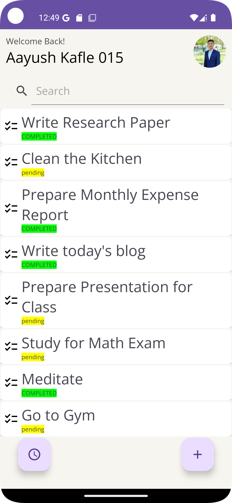
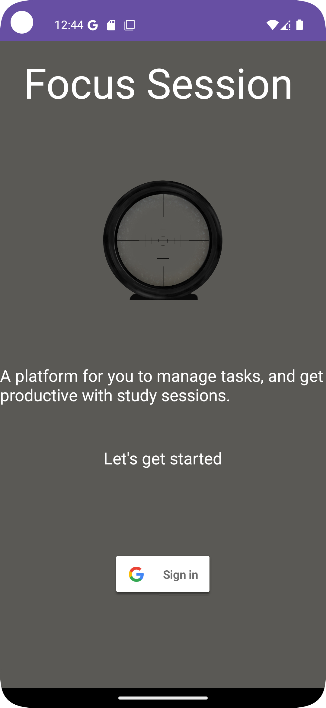
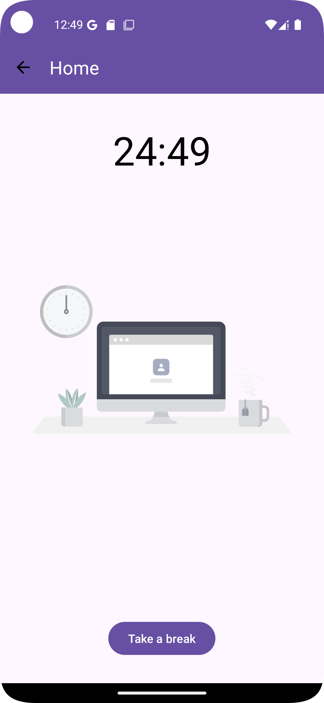
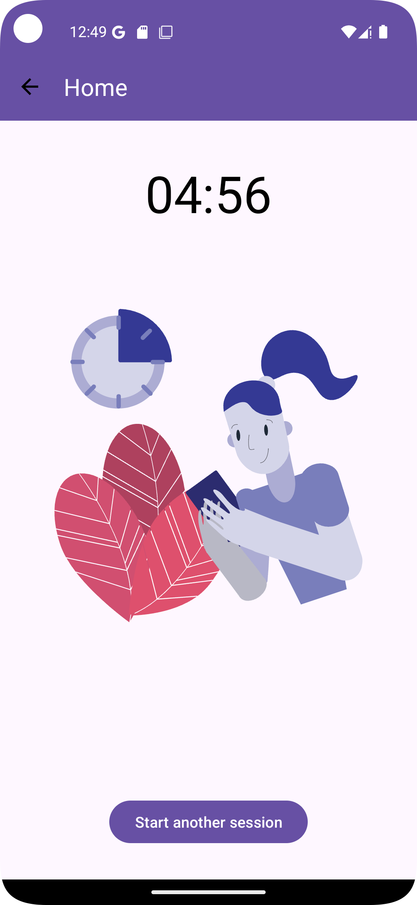
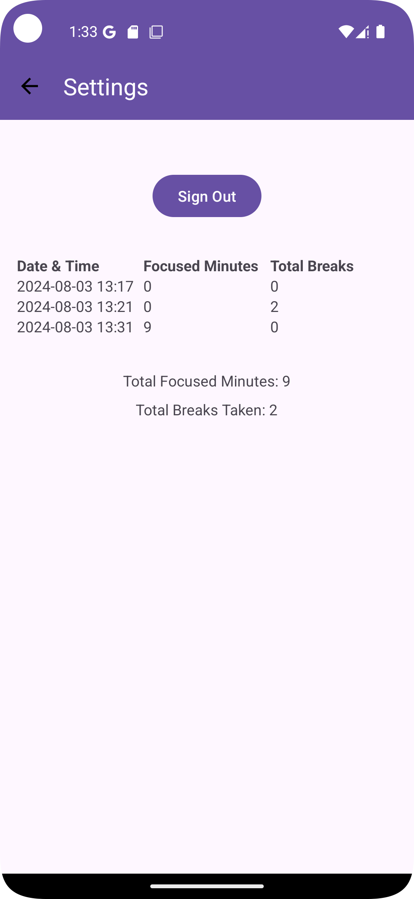

# Focus Session App

Focus Session is a productivity application that helps users manage their time using the Pomodoro Technique. It features a 25-minute focus session followed by a 5-minute break, with a seamless transition between sessions and breaks. The app also includes Google Sign-In for user authentication and a history of completed sessions.

## Video Demo

[Watch the video demo here](https://youtu.be/eu8IlJ4EfSI)

## Features

- **Pomodoro Timer**: Automatically switches between 25-minute focus sessions and 5-minute breaks.
- **Google Sign-In**: Secure user authentication with Google.
- **Session History**: Keeps track of completed focus sessions and breaks, displaying total focused time and breaks taken.
- **User-Friendly Interface**: Simple and intuitive design for easy navigation.

## Installation

1. **Clone the repository:**
    ```bash
    git clone https://github.com/Aayush015/Focus-Session.git
    cd Focus-Session
    ```

2. **Open the project in Android Studio:**
    - Open Android Studio.
    - Select "Open an existing Android Studio project".
    - Navigate to the cloned repository and select it.

3. **Add `google-services.json`:**
    - Go to the [Firebase Console](https://console.firebase.google.com/).
    - Select your project or create a new one.
    - Add an Android app to your project.
    - Download the `google-services.json` file.
    - Place the `google-services.json` file in the `app` directory of your project.

4. **Build and run the project:**
    - Connect your Android device or start an emulator.
    - Click the "Run" button in Android Studio.

## Usage

1. **Sign In:**
    - Open the app and sign in with your Google account.

2. **Start a Focus Session:**
    - Click on the "Start Session" button to begin a 25-minute focus session.

3. **Take a Break:**
    - Once the 25-minute session ends, the app will automatically start a 5-minute break.
    - Alternatively, you can manually start a break by clicking the "Take a Break" button.

4. **View Session History:**
    - Go to the Settings screen to view the history of your focus sessions and breaks.

## Screenshots

### Home Screen



### Other Screenshots (sign in page, study session timer, break timer, & settings menu)

<table>
    <tr>
        <td></td>
        <td></td>
    </tr>
    <tr>
        <td></td>
        <td></td>
    </tr>
</table>

## Project Structure

- **MainActivity.java**: Handles Google Sign-In.
- **HomeActivity.java**: Main screen with options to start a session or go to settings.
- **TimerActivity.java**: Manages the Pomodoro timer.
- **SettingsActivity.java**: Displays session history and includes a sign-out button.
- **TaskListAdapter.java**: Manages the tasks, uploads, and retrieves tasks from firebase database. 

## Dependencies

- **Firebase Authentication**: For Google Sign-In.
- **Lottie**: For animations.
- **CountdownTimer**: For managing the Pomodoro timer.

## Contributing

1. **Fork the repository.**
2. **Create a new branch:**
    ```bash
    git checkout -b feature-branch-name
    ```
3. **Make your changes and commit them:**
    ```bash
    git commit -m 'Add some feature'
    ```
4. **Push to the branch:**
    ```bash
    git push origin feature-branch-name
    ```
5. **Submit a pull request.**